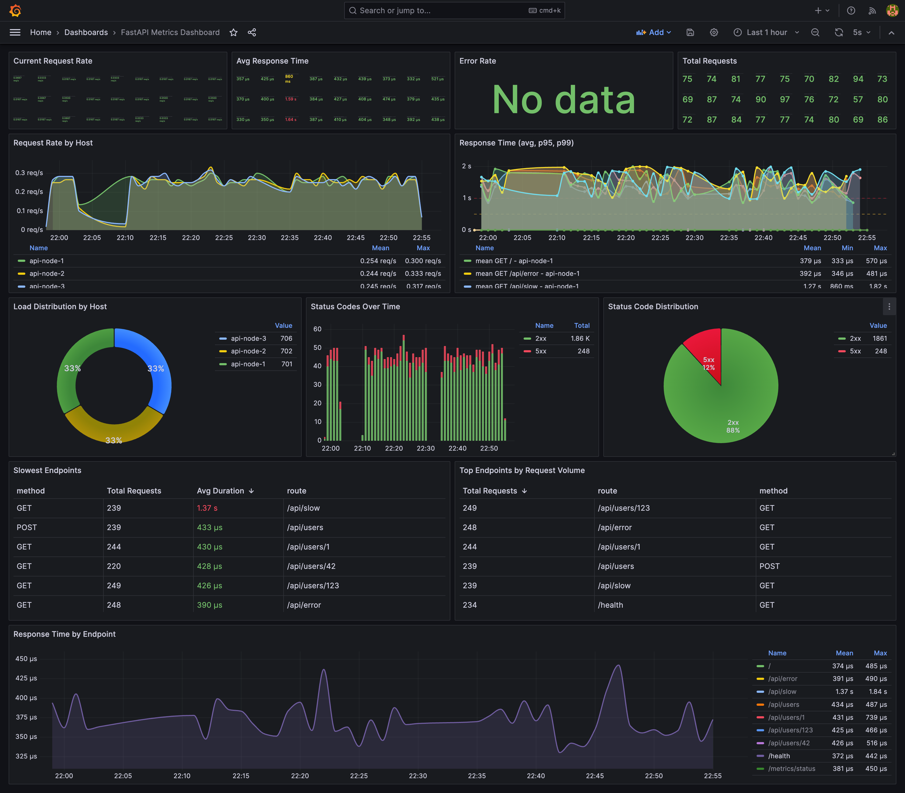

# FastAPI + InfluxDB Metrics Setup

This is a complete boilerplate for tracking FastAPI endpoint metrics and sending them to InfluxDB for visualization in Grafana.

## 🚀 New Features

- **✅ Multi-host tracking** - Hostname tag on all metrics for HA deployments
- **✅ Async writes** - Non-blocking metric writes with better performance
- **✅ Internal queueing** - Metrics buffered when InfluxDB is unavailable
- **✅ Auto-retry** - Background worker automatically retries failed writes
- **✅ Graceful degradation** - API keeps running even if InfluxDB is down

## What's Included

- **FastAPI Application** with example routes
- **Metrics Middleware** that automatically tracks:
  - Request count per endpoint
  - Response times (latency)
  - HTTP status codes
  - HTTP methods
  - **Hostname** (for multi-instance deployments)
- **InfluxDB** for time-series metrics storage
- **Grafana** for visualization
- **Docker Compose** setups for both single and multi-instance deployments
- **Nginx Load Balancer** for HA setup

## Project Structure

```
.
├── app/
│   ├── main.py                   # FastAPI application with lifespan management
│   └── middleware/
│       ├── __init__.py
│       └── metrics.py            # Async metrics middleware with queueing
├── requirements.txt              # Python dependencies
├── Dockerfile                    # FastAPI container image
├── docker-compose.yml            # Multi-instance HA setup (3 nodes + nginx)
├── docker-compose.simple.yml     # Single instance setup
├── nginx.conf                    # Load balancer configuration
├── test_traffic.py               # Enhanced traffic generator
├── test_influx_connection.py     # InfluxDB connection test
└── README.md                     # This file
```

## Quick Start

### Single Instance (Simplest)

```bash
docker-compose -f docker-compose.simple.yml up -d
```

This starts a single API instance on <http://localhost:8000>

### Multi-Instance HA Setup

```bash
docker-compose up -d
```

This starts:

- **3 FastAPI instances** on ports 8001, 8002, 8003
- **Nginx load balancer** on <http://localhost:8000> (distributes traffic)
- **InfluxDB** on <http://localhost:8086>
- **Grafana** on <http://localhost:3000>

## Architecture

### How It Works

```
User Request
    ↓
Nginx LB (port 8000) ──┬─→ API Instance 1 (api-node-1:8001) ──┐
                       ├─→ API Instance 2 (api-node-2:8002) ──┤
                       └─→ API Instance 3 (api-node-3:8003) ──┤
                                                               ↓
                                                    Metrics Queue (in-memory)
                                                               ↓
                                                    Background Worker (batching)
                                                               ↓
                                                         InfluxDB
                                                               ↓
                                                           Grafana
```

### Metrics Flow

1. **Request arrives** → Middleware starts timing
2. **Request processed** → Middleware calculates duration
3. **Metric queued** → Added to in-memory queue (non-blocking)
4. **Background worker** → Flushes batches every 5 seconds
5. **InfluxDB write** → Async batch write (100 metrics/batch)
6. **Retry on failure** → Metrics stay in queue if InfluxDB is down

## Testing the Setup

### 1. Verify All Instances Are Running

```bash
# Test multi-host setup
python test_traffic.py --test-hosts
```

Output:

```
Testing multi-host setup...
✓ Instance 1 (http://localhost:8001): api-node-1 - 200
✓ Instance 2 (http://localhost:8002): api-node-2 - 200
✓ Instance 3 (http://localhost:8003): api-node-3 - 200
```

### 2. Generate Traffic Through Load Balancer

```bash
# Generate traffic for 60 seconds
python test_traffic.py --duration 60

# Generate traffic and also hit instances directly
python test_traffic.py --duration 120 --test-direct
```

### 3. Check Metrics Queue Status

```bash
python test_traffic.py --check-queues
```

Output:

```
Instance 1 (api-node-1):
  Queue: 23 / 10000
  InfluxDB Connected: True
  Worker Running: True
```

### 4. Manual Testing

```bash
# Test through load balancer (round-robin)
curl http://localhost:8000/health
curl http://localhost:8000/

# Test specific instances
curl http://localhost:8001/health  # api-node-1
curl http://localhost:8002/health  # api-node-2
curl http://localhost:8003/health  # api-node-3

# Check metrics queue
curl http://localhost:8001/metrics/status
```

## View Metrics

### In InfluxDB

1. Open <http://localhost:8086>
2. Login: `admin` / `adminpassword`
3. Go to **Data Explorer**
4. Query example:

   ```flux
   from(bucket: "api-metrics")
     |> range(start: -1h)
     |> filter(fn: (r) => r._measurement == "api_request")
     |> filter(fn: (r) => r._field == "count")
     |> group(columns: ["hostname", "route"])
   ```

### In Grafana

1. Open <http://localhost:3000>
2. Login: `admin` / `admin`
3. Add InfluxDB data source:
   - Query Language: **Flux**
   - URL: `http://influxdb:8086`
   - Organization: `my-org`
   - Token: `my-super-secret-token`
   - Default Bucket: `api-metrics`

4. Create dashboard with these queries:

**Request Rate by Host:**

```flux
from(bucket: "api-metrics")
  |> range(start: -1h)
  |> filter(fn: (r) => r._measurement == "api_request")
  |> filter(fn: (r) => r._field == "count")
  |> group(columns: ["hostname"])
  |> aggregateWindow(every: 1m, fn: sum)
```

**Average Response Time by Endpoint:**

```flux
from(bucket: "api-metrics")
  |> range(start: -1h)
  |> filter(fn: (r) => r._measurement == "api_request")
  |> filter(fn: (r) => r._field == "duration")
  |> group(columns: ["route", "hostname"])
  |> aggregateWindow(every: 1m, fn: mean)
```

**Load Distribution (requests per host):**

```flux
from(bucket: "api-metrics")
  |> range(start: -1h)
  |> filter(fn: (r) => r._measurement == "api_request")
  |> filter(fn: (r) => r._field == "count")
  |> group(columns: ["hostname"])
  |> sum()
```

**Error Rate by Status Code:**

```flux
from(bucket: "api-metrics")
  |> range(start: -1h)
  |> filter(fn: (r) => r._measurement == "api_request")
  |> filter(fn: (r) => r._field == "count")
  |> filter(fn: (r) => r.status_class == "4xx" or r.status_class == "5xx")
  |> group(columns: ["status_code", "hostname"])
  |> aggregateWindow(every: 1m, fn: sum)
```

Or you can take the easy route, and import the pre-made dashboard `grafana-dashboard.json` in this repository.



## Metrics Collected

The middleware automatically tracks:

- **Tags** (dimensions):
  - `hostname`: Which server/instance handled the request (**NEW**)
  - `method`: HTTP method (GET, POST, etc.)
  - `route`: API endpoint path
  - `status_code`: HTTP status code (200, 404, 500, etc.)
  - `status_class`: Status code class (2xx, 4xx, 5xx)

- **Fields** (measurements):
  - `duration`: Response time in seconds
  - `count`: Request count (always 1, for aggregation)

## Configuration

### Environment Variables

Configure via environment in `docker-compose.yml`:

- `INFLUX_URL`: InfluxDB URL (default: `http://influxdb:8086`)
- `INFLUX_TOKEN`: InfluxDB authentication token
- `INFLUX_ORG`: InfluxDB organization
- `INFLUX_BUCKET`: InfluxDB bucket name
- `HOST_NAME`: Custom hostname for this instance (for tracking)

### Middleware Parameters

Customize the middleware behavior in `main.py`:

```python
app.add_middleware(
    MetricsMiddleware,
    influx_url=INFLUX_URL,
    influx_token=INFLUX_TOKEN,
    influx_org=INFLUX_ORG,
    influx_bucket=INFLUX_BUCKET,
    hostname=HOSTNAME,           # Custom hostname
    max_queue_size=10000,        # Max metrics to buffer (default: 10000)
    batch_size=100,              # Metrics per batch write (default: 100)
    flush_interval=5.0           # Seconds between flushes (default: 5.0)
)
```

### Scaling the Deployment

**Add more instances:**
Edit `docker-compose.yml` and add more services:

```yaml
fastapi-app-4:
  build: .
  container_name: fastapi-app-4
  hostname: api-node-4
  ports:
    - "8004:8000"
  environment:
    - HOST_NAME=api-node-4
  # ... rest of config
```

Then update `nginx.conf`:

```nginx
upstream fastapi_backends {
    server fastapi-app-1:8000;
    server fastapi-app-2:8000;
    server fastapi-app-3:8000;
    server fastapi-app-4:8000;  # Add new instance
}
```

## Using with Your Existing API

To integrate into your existing FastAPI application:

1. **Copy the middleware:**

   ```bash
   cp -r app/middleware/ /path/to/your/project/app/
   ```

2. **Install dependencies:**

   ```bash
   pip install influxdb-client
   ```

3. **Add to your FastAPI app:**

   ```python
   from fastapi import FastAPI
   from app.middleware.metrics import MetricsMiddleware
   import os

   app = FastAPI()

   app.add_middleware(
       MetricsMiddleware,
       influx_url=os.getenv("INFLUX_URL"),
       influx_token=os.getenv("INFLUX_TOKEN"),
       influx_org=os.getenv("INFLUX_ORG"),
       influx_bucket=os.getenv("INFLUX_BUCKET"),
       hostname=os.getenv("HOST_NAME")
   )
   ```

4. **Add InfluxDB to your docker-compose**

## Development

### Rebuild Containers

```bash
docker-compose up -d --build
```

### View Logs

```bash
# All services
docker-compose logs -f

# Specific service
docker-compose logs -f fastapi-app-1
docker-compose logs -f influxdb
```

### Scale Instances

```bash
# Start only 2 instances instead of 3
docker-compose up -d fastapi-app-1 fastapi-app-2 nginx influxdb grafana
```

### Stop Everything

```bash
docker-compose down
```

### Fresh Start (Remove Data)

```bash
docker-compose down -v
```

## How the Queueing Works

### Normal Operation

1. Request comes in → metric queued (instant)
2. Background worker runs every 5 seconds
3. Worker batches up to 100 metrics
4. Async write to InfluxDB
5. Queue is cleared

### InfluxDB Unavailable

1. Metrics keep queuing up (no blocking)
2. Worker detects write failure
3. Metrics stay in queue (not lost)
4. Worker retries on next interval
5. When InfluxDB comes back, queue flushes

### Queue Full

- Max queue size: 10,000 metrics (configurable)
- If full, oldest metrics are dropped (FIFO)
- Warning logged at 80% capacity

## Production Considerations

### For Production Deployment

1. **Use secrets management**
   - Don't hardcode tokens
   - Use Docker secrets or environment from secrets manager

2. **Adjust queue settings based on traffic:**

   ```python
   # High traffic API
   max_queue_size=50000,  # Larger buffer
   batch_size=500,        # Bigger batches
   flush_interval=2.0     # More frequent flushes

   # Low traffic API
   max_queue_size=1000,
   batch_size=50,
   flush_interval=10.0
   ```

3. **Monitor the queue**
   - Set up alerts on queue size
   - Track InfluxDB connectivity
   - Use the `/metrics/status` endpoint

4. **Configure InfluxDB retention**

   ```bash
   # Keep raw metrics for 7 days
   # Keep downsampled metrics for 90 days
   ```

5. **Add health checks**
   - Check InfluxDB connection
   - Alert on persistent disconnection
   - Monitor queue growth

6. **Load balancer health checks**
   - Use `/health` endpoint
   - Remove unhealthy instances
   - Auto-recovery

7. **Hostname strategy**
   - Use meaningful hostnames: `api-prod-us-east-1`
   - Include region/zone info
   - Helps with debugging and monitoring

## Troubleshooting

**Queue keeps growing:**

- Check InfluxDB is reachable
- Verify credentials
- Check InfluxDB disk space
- Consider increasing `batch_size` or decreasing `flush_interval`

**Metrics not appearing:**

- Check queue status: `curl http://localhost:8001/metrics/status`
- View logs: `docker-compose logs fastapi-app-1`
- Verify InfluxDB health: `docker-compose logs influxdb`

**Load imbalance between hosts:**

- Check nginx logs
- Verify all instances are healthy
- Adjust nginx load balancing algorithm if needed

**High memory usage:**

- Reduce `max_queue_size`
- Increase `flush_interval` to flush more often
- Check for InfluxDB connectivity issues

## Performance Impact

**Middleware overhead:**

- ~0.1-0.5ms per request (metric queuing only)
- No blocking on InfluxDB writes
- Batching reduces write frequency

**Memory usage:**

- ~100 bytes per queued metric
- 10,000 metrics ≈ 1MB
- Adjust `max_queue_size` based on your RAM

## License

This is boilerplate code - use it however you want! 🚀
